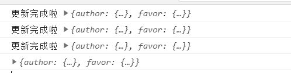
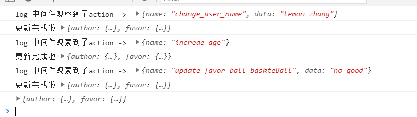
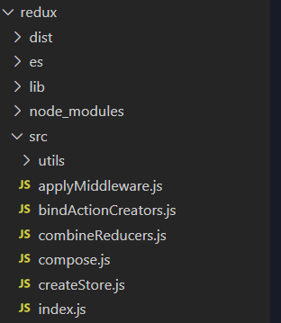

# 从0到1重新撸一个Redux

> 文初先问大家一个简单的问题：Redux是什么？答之：在React项目里解决复杂层级的组件数据沟通问题，更新Redux数据，组件视图也会更新。相信这是绝大多数React项目开发者的答案。包括笔者我一开始也是这么想的。初级工作者停留在一个工具/库的运用场景、API用法以及使用配置方式等等，如果要上升到中高级，无可避免的需要对自己使用中的东西进行更加深入的探秘。于是乎笔者决定从自身对Redux的经验和理解出发从0到1从代码层面解析Redux。笔者翻看了需要掘金啊知乎啊语雀上的许多对Redux的源码解析的文章，而本文不是直接开始show和讲解源码，而是从Redux设计思想和目的出发去实现一个Redux，希望本文对刚开始接触Redux或者希望更深入了解Redux的开发者有所帮助和启示。
<br />
<br />

## Redux只是一个提供数据状态的工具

> 如果要理解Redux，需要把他从脑海中既有的印象和标签撕开，他不属于React，他只是一个数据状态的管理工具而已。切记切记，先把React放在一旁。
<br />
<br />

## 一切的一切从Redux的设计思想开始

- 单一数据流
- STORE（也可以叫做原始数据）只读
- 改变数据要求纯函数
> 所有的代码实现将围绕着这三条设计思想

<br />
<br />

### 按照设计思想去假设
对于MV/XX类框架，最魔法的莫过于改动数据便可以同步驱动视图吧。不管在哪个框架下，那么数据都是第一位存在的东西。于是乎我们假设有以下这个数据:
```
var store = {
    name: 'lemon',
    age: 25

    // 以下还有更多的数据
}
```
整个应用的数据被储存在上面的store中，并且这样的store在应用中只有一个，这便是单一数据流的思想。比如上面的store.name不仅个人介绍页面被用到了也会被个人空间页面所用到。视图中的name数据只会来自一个store。好啦~不管怎样，我们已经有了一个store，里面有各种的视图所需要的数据，一切都在里面保管就好了，十分美妙。
<br />
<br />

来了个需求，我们需要在个人页面编辑name，然后个人空间页面的name就被更新了。好家伙，这不简单吗？于是乎我们想着写入以下代码：
```
store.name = 'lemon zhang'
```
哦吼，抱歉，别忘了Redux设计思想：STORE（也可以叫做原始数据）只读。这样虽然美妙，但是抱歉我们不可以。于是乎我们想到给store添加方法让这个api去改动我们要的数据就好了。那么这个方法就叫做dispatch吧，于是乎有了以下代码
```
store.dispatch({name: 'lemon zhang'});

console.log(store.name); // 'lemon zhang'

```
<br />
<br />
改变数据要求纯函数，纯函数也就是没有副作用的意思。用以下代码理解

```
store.dispatch({name: 'lemon zhang'});
store.name === 'lemon zhang' // true
store.name === 'lemon zhang' // 为false 即dispatch方法里有副作用 输入和输出不唯一
```
总结：按照Redux设计思想，我们需要有个store，只读，只能通过方法dispatch去改动我们的数据，dispatch背后的实现不支持副作用。

### 按照假设去实现吧
直接看代码一步步来吧
```
// 首先我们有个初始数据，切记，这个数据不是store哟，只是提供原始数据源
var initState = {
    name: 'lemon',
    age: 25
};

```
好了，我们需要写一个方法去生成我们需要的store这个方法就起名叫做createStore吧，我们已经假设好了我们心目中store的样子了，让我们在createStore去实现它吧。
```
var initState = {
    name: 'lemon',
    age: 25
};

function createStore(state = initState) {
    const store = {
        ...state
    };
    function dispatch(key, value) {
        store[key] = value;
    }
    function getStore() {
        return store
    }
    return {
        getStore,
        dispatch
    }
}

var store = createStore();
var user = store.getStore();
user.name === 'lemon'; // true
user.age === 25; // true

store.dispatch('name', 'lemon zhang');
store.dispatch('age', 26');

user.name === 'lemon zhang'; // true
user.age === 26; // true

```
啊 是不是真简单。看起来Redux也没什么神奇的地方嘛。于是乎我们把以上代码美滋滋得拿去项目使用，问题是一堆堆的。
```
// 对于多级引用类型的数据，上面dispatch无能为力
var state = {
    detail: {
        user: {
            name: 'lemon',
            age: 25
        }
    }
}
型如store.dispatch('name', 'lemon zhang')的设计将无法使用，无法遍历层级
```
对于一个复杂的大项目而言，有许许多多的数据需要被状态管理，如果所有的数据全部展开放进store里那么无法避免的会带来key重复的问题。但是如果按照模块去划分，以层级结构的方式去设置store那么dispatch是无法使用的。<br />
除此之外，在前端日益复杂的交互场景下也无法适用，比如分页加载，需要反复进行分页请求将数据按照顺序进行拼接在设置进store里面，将带来反复getStore的地狱。

<br />
<br />

所以，这些问题让我们需要重新思考如何设计createStore，让其更合理些。于是乎我们引入“对象结构描述”这一概念，他有个更让人熟悉的名字：reducer。reducer描述了对象再各个场景下的结构形态，什么是场景呢？上一页、下一页、增1、减1都是场景，场景也有个更熟悉的名字：action。
```
// 基于以上思考我们设计形如以下的action
var action = {
    name: 'increase', // 场景名称
    data: 2 // 场景发生时生成的数据
}
```
好了我们有了一个全新的概念action，让我们来根据action设计reducer
```
// 还是这个initState，不过他更复杂了
var initState = {
    name: 'lemon',
    age: 25,
    favor: {
        ball: {
            basketBall: 'well',
            footBall: 'good'
        },
        TV: {
            bilibili: 'usually',
            aqiyi: 'never'
        }
    }
};

function reducer(state = initState, action) {
    switch(action.name) {
        case 'change_user_name': 
            state.name = action.data;
            return state;
        
        case 'increae_age':
            state.age += 1;
            return state;

        case 'update_favor_ball_baskteBall':
            state.favor.ball.basketBall = action.data;
            return state;
        ...
        default:
            return state;
    }
}
```
引入了场景+对象结构描述的概念，使得我们可以更加语义的处理数据的变更，多层级的结构也可以在各种场景下更加细粒度的去改变。来吧，我都迫不及待的想去改造createStore了，完整代码如下
```
// 写入createStore.js
function createStore(reducer, initState = {}) {
    
    if (typeof reducer !== 'function') {
        throw new Error('reducer must be function')
    }
    let store = initState;

    function getStore() {
        return store;
    }

    function dispatch(action) {

        if (typeof action.name === 'undefined') {
            throw new Error('format of action must exist name and data');
        }

        store = reducer(action)
    }

    // 此处初始化store
    dispatch({ name: 'init'});

    return {
        getStore,
        dispatch
    }
}
```
让我们来试试看新createStore有多厉害
```
         var initState = {
            name: 'lemon',
            age: 25,
            favor: {
                ball: {
                    basketBall: 'well',
                    footBall: 'good'
                },
                TV: {
                    bilibili: 'usually',
                    aqiyi: 'never'
                }
            }
        };

        function reducer(state = initState, action) {
            switch (action.name) {
                case 'change_user_name':
                    state.name = action.data;
                    return state;

                case 'increae_age':
                    state.age += 1;
                    return state;

                case 'update_favor_ball_baskteBall':
                    state.favor.ball.basketBall = action.data;
                    return state;

                default:
                    return state;
            }
        }

        function createStore(reducer, initState = {}) {

            if (typeof reducer !== 'function') {
                throw new Error('reducer must be function')
            }
            let store = initState;

            function getStore() {
                return store;
            }

            function dispatch(action) {

                if (typeof action.name === 'undefined') {
                    throw new Error('format of action must exist name and data');
                }

                store = reducer(store, action)
            }

            // 此处初始化store
            dispatch({ name: 'init' });

            return {
                getStore,
                dispatch
            }
        }

        const store = createStore(reducer, initState);

        store.dispatch({
            name: 'change_user_name',
            data: 'lemon zhang'
        });
        store.dispatch({
            name: 'increae_age'
        });
        store.dispatch({
            name: 'update_favor_ball_baskteBall',
            data: 'no good'
        });
        const data = store.getStore();
        console.log(data.name); // lemon zhang
        console.log(data.age); // 26
        console.log(data.favor.ball); // test2.html:92 {basketBall: "no good", footBall: "good"}

```
一切显得多么的优雅，至少现在来看他是能用起来的了，可以这么说到这里已经是Redux设计的最基础的地方。好了，我又开始把上面的代码投入到使用中去了。继续发现了一些问题。项目非常大，如果所有的涉及到数据状态管理的地方都放在一个Reducer中，那么将会臃肿不堪无法维护，那么还是采取按模块去组织我们的Reducer，那么就会有许许多多的Reducer，这块怎么设计呢？
```
// 先拆分Reducer 妈妈快看 我们被拆分了。
// author.js
var author = {
    name: 'lemon',
    age: 25,
};

function Authorreducer(state = author, action) {
    switch(action.name) {
        case 'change_user_name': 
            state.name = action.data;
            return state;
        
        case 'increae_age':
            state.age += 1;
            return state;

        default:
            return state;
    }
}

// authorFavor.js
var myfavor = {
    favor: {
        ball: {
            basketBall: 'well',
            footBall: 'good'
        },
        TV: {
            bilibili: 'usually',
            aqiyi: 'never'
        }
    }
}
function MyFavorreducer(state = myfavor, action) {
    switch(action.name) {
        case 'update_favor_ball_baskteBall':
            state.favor.ball.basketBall = action.data;
            return state;

        default:
            return state;
    }
}

按照模块化开发的原则 上面的代码可以分为2个JS文件，后面提到的话别懵逼，记得是这两个东西就好
```
接下来需要设计一个管理多个Reducer的方法，让他能无缝跟原有的createStore中去使用，我们给这个方法起名为combineReducer吧
```
// 写入combineReducers.js文件
function combineReducers(reducers) {
  const reducerKeys = Object.keys(reducers)
  const finalReducers = {}

  // 一一拷贝
  for (let i = 0; i < reducerKeys.length; i++) {
    const key = reducerKeys[i]

    if (typeof reducers[key] === 'function') {
      finalReducers[key] = reducers[key]
    }
  }
  const finalReducerKeys = Object.keys(finalReducers)

  // 这里是关键，返回一个Reducer
  return function combination(state = {}, action) {
    let hasChanged = false
    const nextState = {}

    for (let i = 0; i < finalReducerKeys.length; i++) {
      const key = finalReducerKeys[i]
      const reducer = finalReducers[key]
      const previousStateForKey = state[key]
      const nextStateForKey = reducer(previousStateForKey, action)
      
      if (typeof nextStateForKey === 'undefined') {
        const errorMessage = getUndefinedStateErrorMessage(key, action)
        throw new Error(errorMessage)
      }
      nextState[key] = nextStateForKey
      hasChanged = hasChanged || nextStateForKey !== previousStateForKey
    }
    hasChanged = hasChanged || finalReducerKeys.length !== Object.keys(state).length
    return hasChanged ? nextState : state
  }
}
```
原理比较简单，以key + Reducer的映射关系组织多个Reducer，最后只返回一个Reducer，dispacth的时候执行一个FOR循环，最后判断前后是否改变决定是否返回一个新数据还是旧数据的state。再来看看我们怎么使用combineReducers吧
```
import AuthorReducer from './author.js'
import AuthorFavorReducer from './authorFavor.js'
import createStore from './createStore.js';
import combineReducers from './combineReducers.js'
const store = createStore(combineReducers({
    author: AuthorReducer,
    favor: AuthorFavorReducer
}));
store.dispatch({
    name: 'change_user_name',
    data: 'lemon zhang'
});
store.dispatch({
    name: 'increae_age'
});
store.dispatch({
    name: 'update_favor_ball_baskteBall',
    data: 'no good'
});
const data = store.getStore();
console.log(data.name); // lemon zhang
console.log(data.age); // 26
console.log(data.favor.ball); // test2.html:92 {basketBall: "no good", footBall: "good"}
```
一切简直太完美了，Enjoy这段旅程吧。当我们更优雅的组织Reducer后，项目中还有个问题，就是形形色色的dispatch充斥着各个模块的代码中，要知道，各种各样的action name直愣愣的就是魔术字符串啊，一旦我们要改动一个action name，项目中就有几十个相同名字的action name需要被改动和替换。实在难受。怎么解决呢？首先我们需要统一管理我们的action了，首先用常量去管理各类action name取代魔术字符，再引入工厂模式actionCreator去生成各类的action。
```
// 以下代码写入bindActionCreator.js
const INCREASEAGE = 'increae_age';
const CHANGENAME = 'change_user_name';
const UPDATEBALL = 'update_favor_ball_baskteBall'

function makeIncreaseAgeActions() {
    return {
        name: INCREASEAGE
    }
}

function makeChangeNameActions(name) {
    return {
        name: CHANGENAME,
        data: name
    }
}
function makeUpdateBasketBallActions(status) {
     return {
        name: UPDATEBALL,
        data: status
    }
}

function bindActionCreator(actionCreator, dispatch) {
  return function() {
    return dispatch(actionCreator.apply(this, arguments))
  }
}

```
最后我们再来看看我们的代码变啥样了。
```
import AuthorReducer from './author.js'
import AuthorFavorReducer from './authorFavor.js'
import createStore from './createStore.js';
import combineReducers from './combineReducers.js'
import {makeIncreaseAgeActions, makeChangeNameActions, makeUpdateBasketBallActions, bindActionCreator} from './bindActionCreator';

const store = createStore(combineReducers({
    author: AuthorReducer,
    favor: AuthorFavorReducer
}));

const changeName = bindActionCreator(makeChangeNameActions, store.dispatch);
const increaseAge =  bindActionCreator(makeIncreaseAgeActions, store.dispatch);
const updateBasketBall =  bindActionCreator(makeUpdateBasketBallActions, store.dispatch);

// 以下这些方法可以导出到任意地方使用 更加语义化
changeName();
increaseAge();
updateBasketBall();

const data = store.getStore();
console.log(data.name); // lemon zhang
console.log(data.age); // 26
console.log(data.favor.ball); // test2.html:92 {basketBall: "no good", footBall: "good"}
```
走到这里，以上代码已经是能完全做到合理并且优雅的管理我们的数据状态了，但是目前他还不够有趣，我们想让他能在更新完数据后进行通知，这样收到通知的接入方就可以拿去干更多有趣的事了，比如更新了redux拿去更新视图，也可以拿去处理其他的业务逻辑，这都是相当好的。我们引入观察者模式，使store拥有被观察的特性。来吧，一起改造createStore。
```
// 重新写入createStore.js
function createStore(reducer, initState = {}) {
    
    if (typeof reducer !== 'function') {
        throw new Error('reducer must be function')
    }
    let store = initState;
    const listeners = []; // 监听者队列

    function getStore() {
        return store;
    }

    function subscribe(fc) {
        listeners.push(fc);

        return function unSubscribe() {
            listeners.splice(listeners.indexOf(fc), 1);
        }
    }

    function dispatch(action) {

        if (typeof action.name === 'undefined') {
            throw new Error('format of action must exist name and data');
        }

        store = reducer(action);

        listeners.forEach(fc => fc());
    }

    // 此处初始化store
    dispatch({ name: 'init'});

    return {
        getStore,
        dispatch,
        subscribe
    }
}
```
来看看怎么使用吧
```
import AuthorReducer from './author.js'
import AuthorFavorReducer from './authorFavor.js'
import createStore from './createStore.js';
import combineReducers from './combineReducers.js'
import {makeIncreaseAgeActions, makeChangeNameActions, makeUpdateBasketBallActions, bindActionCreator} from './bindActionCreator';

const store = createStore(combineReducers({
    author: AuthorReducer,
    favor: AuthorFavorReducer
}));

store.subscribe(() => {
    console.log('更新完成啦', store.getStore())
})
const changeName = bindActionCreator(makeChangeNameActions, store.dispatch);
const increaseAge =  bindActionCreator(makeIncreaseAgeActions, store.dispatch);
const updateBasketBall =  bindActionCreator(makeUpdateBasketBallActions, store.dispatch);

// 以下这些方法可以导出到任意地方使用 更加语义化
changeName();
increaseAge();
updateBasketBall();
```


我们的Redux开始有趣起来了，但是还不够有趣，我们需要提供一种中间件机制，让他完全开放，让dispatch触发action到最终改变store的过程中去做更多的事情，怎么处理呢。还是回到createStore，将提供第三个参数接入中间件机制。注意，这块中间件机制是Redux中最难理解的部分，需要一步步理解。
```
// 重新写入createStore.js
function createStore(reducer, initState = {},  enhancer) {
    
    // 此处接入中间件将整个createStore reducer initState传入
    if (typeof enhancer !== 'undefined') {

        if (typeof enhancer !== 'function') {
            throw new Error('Expected the enhancer to be a function.')
        }

        // 中间件核心
        return enhancer(createStore)(reducer, initState)
    }

    if (typeof reducer !== 'function') {
        throw new Error('reducer must be function')
    }
    let store = initState;
    const listeners = []; // 监听者队列

    function getStore() {
        return store;
    }

    function subscribe(fc) {
        listeners.push(fc);

        return function unSubscribe() {
            listeners.splice(listeners.indexOf(fc), 1);
        }
    }

    function dispatch(action) {

        if (typeof action.name === 'undefined') {
            throw new Error('format of action must exist name and data');
        }

        store = reducer(store, action);

        listeners.forEach(fc => fc());
    }

    // 此处初始化store
    dispatch({ name: 'init'});

    return {
        getStore,
        dispatch,
        subscribe
    }
}
```
我们将createStore reducer initState全部交出，让enhancer自己去玩，背后的设计比较复杂涉及函数式编程思想，不急我们一步步来。先来理解COMPOSE
```
function compose(funcs) {
  if (funcs.length === 0) {
    return arg => arg
  }

  if (funcs.length === 1) {
    return funcs[0]
  }

  return funcs.reduce((a, b) => (...args) => a(b(...args)))
}
```
reduce谁都认识吧？不认识麻烦去MDN查看文档此处不再叙述哈。实在看得头疼看看以下代码方便理解
```
function add1(a) {
    return a + 1
}
function add2(a) {
    return a + 2
}
function add3(a) {
    return a + 3
}
const add = compose([add1, add2, add3]);
add(5) === add1(add2(add3(5)))
```
实在难以理解就要断点去看看啦~接着我们继续 看怎么把所有的中间件组织起来
```
function applyMiddleware(middlewares) {

  // 返回一个持有createStore的函数
  // 这也是createStore里return enhancer(createStore)(reducer, initState)的设计
  return createStore => (...args) => {
    const store = createStore(...args) // 根据传入的reducer initState生成store

    let dispatch = () => {

      throw new Error(
        'Dispatching while constructing your middleware is not allowed. ' +
          'Other middleware would not be applied to this dispatch.'
      )
    }

    // 核心API注入到每个中间件去
    const middlewareAPI = {
      getStore: store.getStore,
      dispatch: args => dispatch(args)
    }

    // 注入每一个中间件 并且返回函数数组 注意 这就要求中间件的写法必须middlewareAPI => args => {// do something}
    const chain = middlewares.map(middleware => middleware(middlewareAPI))

    // 将dispatch放入中间件的链式调用中去 返回一个新的dispatch
    // 这要求compose(chain)返回一个形如 dispatch => (...arags) => {}
    // 所以我们反推回去middleware的写法需要形如middlewareAPI => dispatch => args => {// do something}
    dispatch = compose(chain)(store.dispatch)

    // 返回一个store，注意dispatch已经是新的dispatch了
    // 每次执行dispatch将会触发链式的中间件
    return {
      ...store,
      dispatch
    }
  }
}

```
对于这段核心的方法已经解析完毕，不清楚的话要多看几遍了 基本每段都有注释。让我们开始写中间件试试水吧。先写一个redux-log中间件吧 每次执行都打印日志 方便追踪。
```
const reduxLog = middlewareAPI => dispatch => args => {
    console.log('log 中间件观察到了action -> ', args);
    dispatch(args);
}
```
是不是十分简单呢，来测试一下最终效果吧
```
import {AuthorReducer, AuthorFavorReducer, initState} from './reducer.js'
import combineReducers from './combineReducers.js'
import {makeIncreaseAgeActions, makeChangeNameActions, makeUpdateBasketBallActions, bindActionCreator} from './bindActionCreator';
import {reduxLog} from './middleware';
import applyMiddleware from './applyMiddleware';
import compose from './compose';

const store = createStore(combineReducers({
    author: AuthorReducer,
    favor: AuthorFavorReducer
}), initState, compose(applyMiddleware([reduxLog])));

store.subscribe(() => {
    console.log('更新完成啦', store.getStore())
})
const changeName = bindActionCreator(makeChangeNameActions, store.dispatch);
const increaseAge =  bindActionCreator(makeIncreaseAgeActions, store.dispatch);
const updateBasketBall =  bindActionCreator(makeUpdateBasketBallActions, store.dispatch);

// 以下这些方法可以导出到任意地方使用 更加语义化
changeName();
increaseAge();
updateBasketBall();
```
看看效果吧


# 总结
行文至此，已经将redux解析完毕。通过从设计思想 假设实现 逐渐优化和改进。从每一个细节处感受Redux的设计。最后我们再来看看官网Redux的结构组织是怎样的。
<br />


可以看出来别无二致，但是官网Redux还是有诸多的细节，比如参数检测等等 本文就没有一一分析了，相比网上许多的源码解析文章话不多说先一通解析，笔者觉得知其然更要知其所以然。如果我的文章有帮助到你，别忘记点个赞好吗？
PS(本文所有代码可在github仓库[mini-redux](https://github.com/lemondreamtobe/mini-redux)中找到)，别忘了点个星哦~
